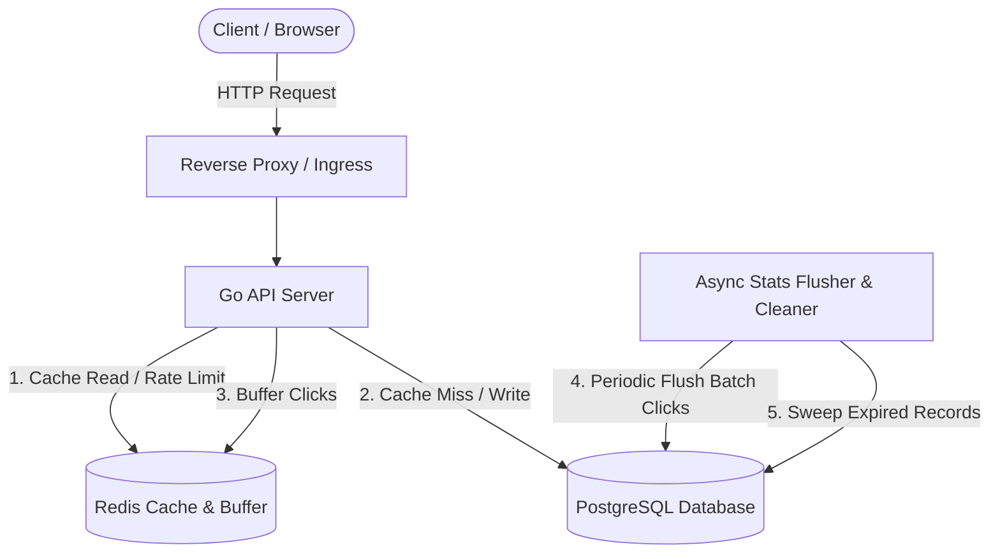
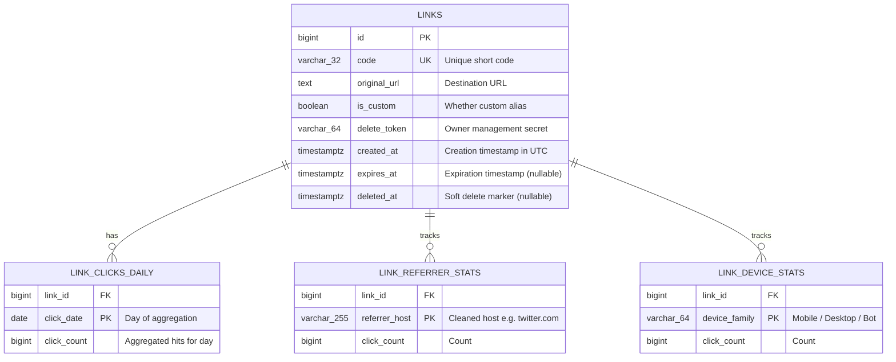
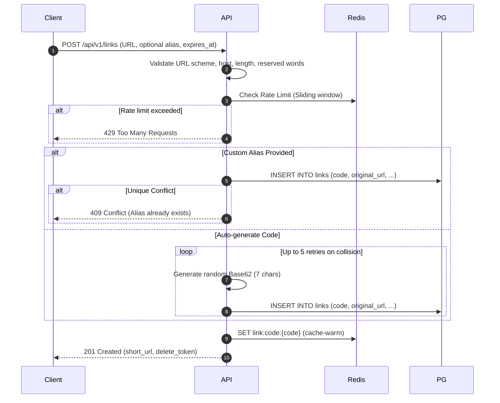
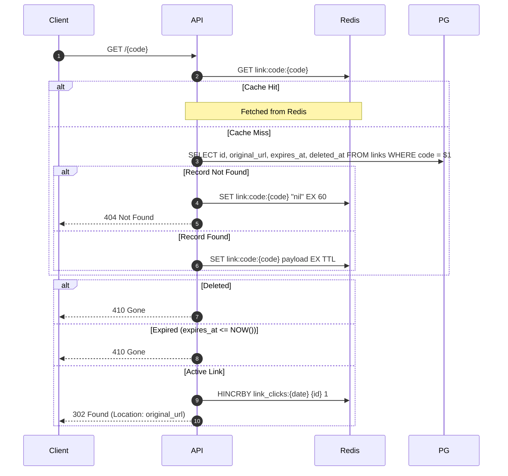

# System Design: URL Shortener Service

## 1. Overview & Architecture

The URL Shortener service converts long URLs into compact, shareable short codes, handles high-throughput redirects, tracks access statistics, and enforces expiration and security policies.

### 1.1 Tech Stack Justification
- **Programming Language & Framework:** **Go (Golang)** with `chi` router (lightweight, idiomatic, standard `net/http` compatible) and standard library primitives. Go is chosen for its low memory footprint, excellent concurrency model (goroutines for background batching), and fast startup/execution times.
- **Primary Database:** **PostgreSQL** (`pgx/v5` connection pool). PostgreSQL provides ACID transactions, robust row-level locking, partial indexes, and strong unique constraints essential for identifier uniqueness.
- **Cache & Buffering:** **Redis** (`go-redis/v9`). Used as a cache-aside layer for the redirect hot path, distributed rate limiting, and an asynchronous click counter buffer to prevent database write contention.

### 1.2 System Architecture Diagram



---

## 2. Database Design

### 2.1 Schema Definition (PostgreSQL)

```sql
-- Migration: 000001_init_schema.up.sql

-- 1. Links table
CREATE TABLE IF NOT EXISTS links (
    id              BIGSERIAL PRIMARY KEY,
    code            VARCHAR(32) NOT NULL,
    original_url    TEXT NOT NULL,
    is_custom       BOOLEAN NOT NULL DEFAULT FALSE,
    delete_token    VARCHAR(64) NOT NULL, -- Secret token for owner deletion/management
    created_at      TIMESTAMPTZ NOT NULL DEFAULT (NOW() AT TIME ZONE 'UTC'),
    expires_at      TIMESTAMPTZ NULL,     -- NULL means no expiration
    deleted_at      TIMESTAMPTZ NULL      -- Soft deletion timestamp
);

-- Unique constraint on short code (strictly enforced at DB level)
CREATE UNIQUE INDEX IF NOT EXISTS uq_links_code ON links (code);

-- Partial index for active links lookup
CREATE INDEX IF NOT EXISTS idx_links_code_active 
    ON links (code) 
    WHERE deleted_at IS NULL;

-- Index for expiration cleanup worker
CREATE INDEX IF NOT EXISTS idx_links_expires_at 
    ON links (expires_at) 
    WHERE expires_at IS NOT NULL AND deleted_at IS NULL;

-- Optional index for URL deduplication lookup (if deduplication mode is enabled)
CREATE INDEX IF NOT EXISTS idx_links_original_url 
    ON links (original_url) 
    WHERE deleted_at IS NULL AND expires_at IS NULL;


-- 2. Aggregate Click Statistics (daily rollup to eliminate row contention)
CREATE TABLE IF NOT EXISTS link_clicks_daily (
    link_id         BIGINT NOT NULL REFERENCES links(id) ON DELETE CASCADE,
    click_date      DATE NOT NULL,
    click_count     BIGINT NOT NULL DEFAULT 0,
    PRIMARY KEY (link_id, click_date)
);

CREATE INDEX IF NOT EXISTS idx_clicks_daily_date ON link_clicks_daily (click_date);


-- 3. Click Metadata Rollup (referrers and user-agent categories)
CREATE TABLE IF NOT EXISTS link_referrer_stats (
    link_id         BIGINT NOT NULL REFERENCES links(id) ON DELETE CASCADE,
    referrer_host   VARCHAR(255) NOT NULL,
    click_count     BIGINT NOT NULL DEFAULT 0,
    PRIMARY KEY (link_id, referrer_host)
);

CREATE TABLE IF NOT EXISTS link_device_stats (
    link_id         BIGINT NOT NULL REFERENCES links(id) ON DELETE CASCADE,
    device_family   VARCHAR(64) NOT NULL, -- e.g. "Mobile", "Desktop", "Bot", "Other"
    click_count     BIGINT NOT NULL DEFAULT 0,
    PRIMARY KEY (link_id, device_family)
);
```

### 2.2 Entity-Relationship (ER) Diagram



### 2.3 Eliminating Row Contention on the Hot Path
Directly executing `UPDATE links SET clicks = clicks + 1 WHERE id = ...` on every redirect causes severe row locking under traffic spikes (e.g. viral links), exhausting database connection pools and serializing concurrent requests.

**Our Click Recording Solution:**
1. **Redis In-Memory Buffering:** On redirect, the HTTP handler enqueues click metadata into a fast in-memory structure:
   - Increment daily counter: `HINCRBY link_clicks:{date} {link_id} 1`
   - Increment total buffer: `HINCRBY link_clicks:total {link_id} 1`
   - Top referrers: `ZINCRBY link_ref:{link_id} 1 {referrer_host}`
2. **Batch Persistence Worker:** A background Go worker runs every 5 seconds (or triggers when buffer size reaches 1,000 items):
   - Atomically renames/extracts buffered keys.
   - Flushes counts to PostgreSQL using `INSERT ... ON CONFLICT (link_id, click_date) DO UPDATE SET click_count = link_clicks_daily.click_count + EXCLUDED.click_count`.
3. **Resilience / Cache Down Fallback:** If Redis is temporarily unreachable, the API falls back to an in-memory Go bounded channel (`chan ClickEvent`, buffer size 10,000) drained by a local batch flusher. If the in-memory buffer saturates, clicks are dropped rather than blocking the redirect response.

### 2.4 Retention and Cleanup of Expired Links
- **Soft Expiration on Hot Path:** The redirect query checks `expires_at IS NULL OR expires_at > NOW()`. If expired, the API immediately returns `410 Gone`.
- **Background Purge Worker:** A daily cron worker runs during low-traffic windows using chunked deletes to avoid table-level lock contention and WAL spikes:
  ```sql
  -- Delete in chunks of 500 rows with pauses between iterations
  DELETE FROM links 
  WHERE id IN (
      SELECT id FROM links 
      WHERE expires_at IS NOT NULL 
        AND expires_at < (NOW() AT TIME ZONE 'UTC' - INTERVAL '30 days')
      LIMIT 500
  );
  ```
  `ON DELETE CASCADE` automatically cleans up associated child stats. Deletions pause 100ms between chunks.

---

## 3. Unique Identifiers & Code Generation

### 3.1 Code Generation Strategy Comparison

| Strategy | Pros | Cons | Recommendation |
| :--- | :--- | :--- | :--- |
| **Sequential Counter + Base62** | Compact, 0% collisions | Trivially enumerable, leaks link volume and business metrics, predictable | ❌ Rejected (violates enumeration rule) |
| **MD5/SHA256 Hash Truncation** | Deterministic deduplication | High collision probability on short prefixes, collisions require salt management | ❌ Rejected |
| **Snowflake-like ID + Base62** | Time-ordered, distributed | Enumerable, 64-bit integer yields longer codes (10-11 chars) | ❌ Rejected |
| **Cryptographically Secure Random Base62 (7 chars)** | Non-enumerable, decentralized, uniform distribution, compact | Potential birthday collisions at scale (requires retry loop) | ✅ **Selected** |

### 3.2 Keyspace & Collision Math
- **Alphabet:** `[0-9a-zA-Z]` (62 alphanumeric characters, URL-safe without escaping).
- **Code Length:** 7 characters.
- **Total Keyspace:** $62^7 = 3,521,614,606,208$ (~3.52 trillion unique combinations).
- **Collision Probability (Birthday Paradox):**
  $$\text{Probability } P \approx 1 - e^{-\frac{n^2}{2 \times N}}$$
  - At $n = 100,000$ links: $P \approx 0.00014\%$ (practically zero).
  - At $n = 1,000,000$ links: $P \approx 0.014\%$.
  - At $n = 10,000,000$ links: $P \approx 1.4\%$.
- **Collision Handling Algorithm:**
  1. Generate random 7-character Base62 string using Go's `crypto/rand`.
  2. Attempt database insert.
  3. If unique constraint violation (`23505` in PostgreSQL) occurs, retry with a new code up to **5 attempts**.
  4. If 5 attempts fail (statistically improbable unless keyspace is nearly exhausted), return error `500 Internal Server Error` with alert logging.

### 3.3 Custom Aliases vs Generated Codes
- **Unified Namespace:** Custom aliases and generated codes share the same `links.code` column with a DB unique constraint.
- **Allowed Alias Rules:**
  - Length: Between 3 and 32 characters.
  - Character set: `[a-zA-Z0-9_-]` (alphanumeric, hyphens, underscores).
  - Reserved keywords check: Case-insensitively blacklisted (see Section 5.3).
- **Case Sensitivity:**
  - Standard RFC 3986 treats path components as case-sensitive (`/abc` $\neq$ `/ABC`).
  - Generated and custom codes are treated as **case-sensitive** in storage and lookup.
  - Reserved word checks are **case-insensitive** (e.g., `API`, `Api`, and `api` are all blocked).

---

## 4. API Design

All endpoints are versioned under `/api/v1` except for the redirect path `/{code}` and the health probe `/health`.

### 4.1 Endpoints Specification

| Method | Path | Description | Status Codes |
| :--- | :--- | :--- | :--- |
| `POST` | `/api/v1/links` | Create a short URL | `201 Created`, `400 Bad Request`, `409 Conflict`, `422 Unprocessable`, `429 Too Many Requests` |
| `GET` | `/api/v1/links/{code}` | Get link metadata | `200 OK`, `404 Not Found`, `410 Gone` |
| `GET` | `/api/v1/links/{code}/stats` | Get link click statistics | `200 OK`, `404 Not Found`, `410 Gone` |
| `DELETE` | `/api/v1/links/{code}` | Delete a link (requires delete token) | `204 No Content`, `401 Unauthorized`, `404 Not Found` |
| `GET` | `/{code}` | Redirect to original URL | `302 Found`, `404 Not Found`, `410 Gone` |
| `GET` | `/health` | Liveness & readiness probe | `200 OK`, `503 Service Unavailable` |

### 4.2 Standard Error Shape
All error responses adhere to a uniform JSON structure:

```json
{
  "error": {
    "code": "INVALID_URL",
    "message": "The provided URL is not a valid HTTP or HTTPS destination.",
    "details": [
      {
        "field": "url",
        "issue": "must have http or https scheme"
      }
    ]
  }
}
```

### 4.3 Request / Response Payloads

#### 1. Create Link (`POST /api/v1/links`)
Request:
```json
{
  "url": "https://developer.mozilla.org/en-US/docs/Web/HTTP",
  "alias": "mdn-http",
  "expires_at": "2026-12-31T23:59:59Z"
}
```
Response (`201 Created`):
```json
{
  "code": "mdn-http",
  "short_url": "https://sho.rt/mdn-http",
  "original_url": "https://developer.mozilla.org/en-US/docs/Web/HTTP",
  "created_at": "2026-10-08T10:15:00Z",
  "expires_at": "2026-12-31T23:59:59Z",
  "delete_token": "sec_d7a8f9c2e1b409a87123"
}
```

#### 2. Get Statistics (`GET /api/v1/links/{code}/stats?from=2026-10-01&to=2026-10-08`)
Response (`200 OK`):
```json
{
  "code": "mdn-http",
  "original_url": "https://developer.mozilla.org/en-US/docs/Web/HTTP",
  "created_at": "2026-10-08T10:15:00Z",
  "expires_at": "2026-12-31T23:59:59Z",
  "total_clicks": 1420,
  "daily_clicks": [
    { "date": "2026-10-07", "clicks": 810 },
    { "date": "2026-10-08", "clicks": 610 }
  ],
  "top_referrers": [
    { "referrer": "twitter.com", "clicks": 950 },
    { "referrer": "direct", "clicks": 470 }
  ],
  "devices": [
    { "family": "Desktop", "clicks": 1000 },
    { "family": "Mobile", "clicks": 420 }
  ]
}
```

#### 3. Delete Link (`DELETE /api/v1/links/{code}`)
Header: `X-Delete-Token: sec_d7a8f9c2e1b409a87123`
Response: `204 No Content`

---

## 5. Security Considerations

### 5.1 URL Validation & Disallowed Schemes
- **Scheme Allowlist:** Strictly `http` and `https`. Schemes such as `javascript:`, `data:`, `file:`, `ftp:`, `vbscript:` are rejected with `422 INVALID_SCHEME`.
- **Input Size Caps:**
  - Maximum URL length: 2,048 characters.
  - Maximum Alias length: 32 characters.
  - Request body limit: 16 KB.

### 5.2 SSRF and Self-Referential Redirect Loops
- **Loop Prevention:** The target URL host is checked against the shortener's own domain (e.g. `sho.rt`, `localhost`, `127.0.0.1`).
- **Internal / Private IP Blocking:** If configured in restricted environment, URLs resolving to loopback (`127.0.0.0/8`, `::1`), link-local (`169.254.0.0/16`), or private RFC 1918 networks (`10.0.0.0/8`, `172.16.0.0/12`, `192.168.0.0/16`) are rejected to prevent internal network scanning.

### 5.3 Reserved Routes & Namespace Squatting
Any custom alias matching reserved paths is rejected with `409 RESERVED_ALIAS`.
**Reserved Words List:**
`api`, `health`, `metrics`, `stats`, `admin`, `static`, `assets`, `favicon.ico`, `robots.txt`, `sitemap.xml`, `docs`, `swagger`, `v1`, `v2`, `auth`, `login`, `register`, `dashboard`.

### 5.4 Privacy & IP Handling
- **Zero Raw IP Storage:** The system strictly avoids storing raw IP addresses to comply with privacy frameworks (GDPR, CCPA).
- Referrers are parsed down to hostnames (e.g. `https://t.co/xyz` $\rightarrow$ `t.co`). Full referrer URLs containing query parameters or personal tokens are stripped.
- User-Agent strings are classified into coarse device categories (`Mobile`, `Desktop`, `Tablet`, `Bot`, `Other`).

### 5.5 Abuse & Rate Limiting
- **Create Endpoint Rate Limiting:** Redis-backed sliding window rate limiter:
  - By Client IP / API Key: Max 60 creates per minute.
  - Burst limit: 10 per second.
  - On violation: `429 Too Many Requests` with `Retry-After` header.

### 5.6 Management Token (`delete_token`) Security
- Tokens are generated with 256 bits of entropy (`crypto/rand`, 32 bytes encoded to 64 hex characters).
- Token verification strictly uses constant-time string comparison (`crypto/subtle.ConstantTimeCompare`) to eliminate timing attacks.
- The `DELETE` endpoint is rate limited to 5 attempts per minute per IP.

### 5.7 HTTP Server Timeouts & Payload Capping
- Defend against Slowloris and resource exhaustion attacks using explicit `http.Server` timeouts:
  - `ReadTimeout`: 5 seconds
  - `ReadHeaderTimeout`: 2 seconds
  - `WriteTimeout`: 10 seconds
  - `IdleTimeout`: 120 seconds
- Inbound request bodies wrapped with `http.MaxBytesReader(w, r.Body, 16384)` (16 KB limit).

---

## 6. Performance & Reliability Considerations

### 6.1 Redirect Hot Path: 301 vs 302 Trade-off
- **Decision: `302 Found` (Temporary Redirect).**
- **Trade-off Analysis:**
  - `301 Moved Permanently`: Browser caches the redirect response indefinitely. Subsequent clicks bypass our server entirely.
    - *Consequence:* Stats are severely undercounted; expiration cannot be enforced once cached in the client's browser.
  - `302 Found`: Browser re-requests the redirect on every click.
    - *Benefits:* Accurate click counting, instantaneous expiration enforcement, ability to change target URL if needed.
    - *Cache Header:* Return `Cache-Control: private, max-age=0, no-cache` to ensure every visit passes through the service.

### 6.2 Redis Cache-Aside & Thundering Herd Defense
- **Cache Key:** `link:code:{code}`
- **Cache Value:** JSON/MsgPack containing:
  ```json
  { "id": 1024, "url": "https://example.com", "expires_at": 1798761599, "deleted": false }
  ```
- **TTL Strategy:**
  - If `expires_at` is set: $\text{TTL} = \min(3600, \text{expires\_at} - \text{now})$.
  - If no expiration: $\text{TTL} = 3600$ (1 hour).
  - Negative Caching: If a code does not exist in DB, store a sentinel (`"nil"`) with $\text{TTL} = 60$ seconds to mitigate cache penetration from scanners/attackers.
- **SingleFlight (Cache Stampede Mitigation):**
  - When a cache miss occurs, goroutines pass through Go's `golang.org/x/sync/singleflight.Group`.
  - Only one database query executes for a given code concurrently; duplicate in-flight requests wait for and share the result, preventing database connection exhaustion under 10k+ req/s.

### 6.3 Graceful Shutdown & Buffer Draining
- On receiving `SIGTERM` or `SIGINT`, the application stops accepting new requests, drains the Redis/in-memory click count buffer, flushes all pending counts to PostgreSQL within a 10-second timeout, and closes database connections cleanly.

### 6.4 Expected Latency & Connection Pooling
- **p99 Latency Target:**
  - Cache Hit: $< 5\text{ ms}$ (Redis read + in-memory response).
  - Cache Miss: $< 25\text{ ms}$ (PostgreSQL indexed read).
- **PostgreSQL Connection Pool:** Configured via `pgxpool` with MaxConns = 50, MinConns = 10, MaxConnIdleTime = 5m.

---

## 7. Execution Flows (Sequence Diagrams)

### 7.1 Link Creation Flow



### 7.2 Redirect Flow



---

## 8. Edge-Case Matrix

| Edge Case | Expected System Behavior | Test Strategy |
| :--- | :--- | :--- |
| **1. Same long URL shortened twice** | Creates a **new unique code** each time. *Rationale:* Allows distinct owners to have their own private delete tokens and stats tracking for identical targets. | Call POST twice with identical URL; assert two different 201 short codes. |
| **2. Unicode / IDN host & punycode** | Convert IDN to punycode / ASCII via RFC 5891 / Go `idna` package before validation; store normalized valid URL. | Provide `https://münchen.de/path`; verify valid redirection and storage. |
| **3. Very long query strings & fragments** | Supported up to 2,048 characters. Fragments (`#hash`) are preserved in destination URL. | Test URL with 2,000 char query params + fragment; assert exact redirect destination. |
| **4. Redirect to shortener itself (loops)** | Checked against configured application base domain and IP; rejected with `422 REDIRECT_LOOP`. | Post `https://sho.rt/abc`; assert 422 error. |
| **5. Custom alias collision / reserved words** | If alias matches reserved word $\rightarrow$ `409 RESERVED_ALIAS`. If already taken $\rightarrow$ `409 ALIAS_CONFLICT`. | Test alias `api`, `health`, and duplicate custom alias; assert 409 responses. |
| **6. Case sensitivity (`abc` vs `ABC`)** | Codes are case-sensitive. Both `/abc` and `/ABC` can coexist as distinct links. | Create both `abc` and `ABC` pointing to different URLs; verify each redirects correctly. |
| **7. Expiration in past / zero / future** | Past or zero TTL rejected on creation with `422 INVALID_EXPIRATION`. Valid future timestamp accepted. | Test `expires_at` 10 minutes ago $\rightarrow$ 422. Test valid future $\rightarrow$ 201. |
| **8. Link expires between cache read and redirect** | Application checks `expires_at` against injected UTC clock *after* retrieving payload (from cache or DB). If expired $\rightarrow$ `410 Gone`. | Cache entry with 500ms remaining; advance mock clock by 1s; assert 410 Gone. |
| **9. Non-existent vs expired vs deleted** | Never existed $\rightarrow$ `404 Not Found`. Expired $\rightarrow$ `410 Gone`. Deleted $\rightarrow$ `410 Gone`. | Create, delete, and query non-existent; verify correct 404 vs 410 status codes. |
| **10. Concurrent creation of same alias** | DB unique constraint catches race condition; first transaction commits (201), second receives constraint error and returns `409 Conflict`. | Spin up 10 concurrent goroutines submitting identical alias; assert exactly 1 success (201) and 9 conflicts (409). |
| **11. High concurrency bot / crawler clicks** | Requests with `HEAD` method or `User-Agent` matching common social crawlers (e.g. `facebookexternalhit`, `Twitterbot`, `Slackbot`) follow redirect but are flagged in device stats rollup. Async buffer prevents DB lockups. | Benchmark 5,000 concurrent redirects; ensure 0 DB lock errors and accurate flush count. |
| **12. Trailing slashes, whitespace, missing scheme** | Auto-trim whitespace. Reject missing scheme (`example.com`) with `422 INVALID_URL` (explicit scheme required to avoid user ambiguity). | Test `  https://example.com/  ` $\rightarrow$ trimmed; test `example.com` $\rightarrow$ 422 error. |
| **13. Redis unavailable (degraded mode)** | Cache fallback to direct PostgreSQL read; click counts buffered in local Go channel. Service remains fully operational. | Simulate Redis disconnection; verify redirects and creation succeed without panic. |
| **14. PostgreSQL unavailable** | If Redis has cached redirect, serve `302 Found`. If cache miss or write endpoint $\rightarrow$ `503 Service Unavailable`. | Stop DB mock; verify cached redirect returns 302, write returns 503. |
