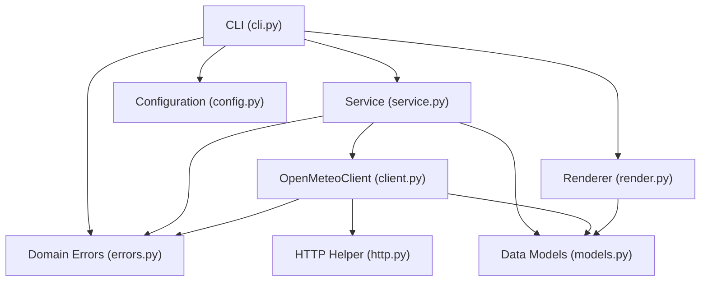

# Open-Meteo Terminal Weather Dashboard

A resilient, layered terminal weather dashboard that consumes the public [Open-Meteo](https://open-meteo.com/) APIs without requiring an API key. Built with Python 3.11+, `httpx`, `pydantic` v2, `pydantic-settings`, `typer`, and `rich`.

---

## Features

- **Geocoding & Forecast Integration**: Resolves city names and fetches current conditions along with up to 16 days of daily forecasts.
- **Rich Terminal UI**: Displays a header panel (location, coordinates, local time), current conditions (temperature, apparent temperature, humidity, wind speed), and a formatted daily forecast table.
- **Defensive Error Handling**: Converts network failures, timeouts, rate limits, schema discrepancies, and 4xx/5xx responses into domain exceptions with strict CLI exit codes.
- **Resilient HTTP Engine**: Sync `httpx.Client` with connection reuse, configurable connect/read timeouts, exponential backoff with jitter, and `Retry-After` header parsing.
- **Four-Tier Configuration**: Hierarchical settings precedence (built-in defaults < TOML configuration file < `WEATHER_*` environment variables < CLI flags).
- **Comprehensive Offline Test Suite**: 100% offline unit and integration tests using `pytest` and `respx` mock routing, plus an opt-in live smoke test suite.

---

## Architecture

The project enforces strict layer boundaries:
- **`client.py`** is the **only** module that performs HTTP operations with `httpx`.
- Higher layers (`service.py`, `cli.py`, `render.py`) only interact with clean domain models and domain exceptions.
- **`models.py`** separates raw API payloads (`*Response`) from domain dataclasses (`Location`, `CurrentConditions`, `DailyForecastItem`, `Dashboard`).
- **`render.py`** is a pure rendering function that takes domain models and formats output using `rich`.



---

## Installation & Setup

Requirements: **Python 3.11+** and **uv** (or `pip`).

```bash
# Clone the repository and install dependencies
uv sync --extra dev

# Alternatively using pip:
pip install -e ".[dev]"
```

---

## Usage

```bash
# Basic usage with city name
uv run weather Naga

# Specify forecast days and measurement units (metric or imperial)
uv run weather "New York" --days 5 --units imperial

# Run using default_city configured in config or environment
uv run weather

# Pass custom TOML config file
uv run weather Tokyo --config path/to/config.toml

# Enable verbose logging (DEBUG logs and exception tracebacks)
uv run weather Naga --verbose
```

### CLI Options

| Argument / Option | Short | Description |
| ----------------- | ----- | ----------- |
| `city`            | —     | Optional positional city name. Defaults to `default_city` from config. |
| `--days`          | `-d`  | Number of forecast days (1 to 16). |
| `--units`         | `-u`  | Unit system: `metric` (°C, km/h) or `imperial` (°F, mph). |
| `--config`        | `-c`  | Path to TOML configuration file. |
| `--verbose`       | `-v`  | Enable detailed debug logging and tracebacks. |
| `--help`          | —     | Show help message and exit. |

---

## Configuration

Settings are evaluated in the following order of precedence:

$$\text{Built-in Defaults} < \text{TOML file} < \text{Environment Variables } (\texttt{WEATHER\_*}) < \text{CLI Flags}$$

### Discovery Order for TOML Files
1. Explicit `--config <path>` option passed on CLI.
2. `$XDG_CONFIG_HOME/weather-dashboard/config.toml` (if `$XDG_CONFIG_HOME` is set).
3. `~/.config/weather-dashboard/config.toml`.

See [`config.example.toml`](file:///home/userman/Projects/AIDevelopmentProjects/weatherDashboard/config.example.toml) for reference settings:

```toml
geocoding_base_url = "https://geocoding-api.open-meteo.com/v1"
forecast_base_url = "https://api.open-meteo.com/v1"
connect_timeout = 5.0
read_timeout = 10.0
max_retries = 3
backoff_base = 0.5
units = "metric"
forecast_days = 7
default_city = "Naga"
user_agent = "weather-dashboard/0.1.0"
```

### Environment Variables
Any setting can be overridden via `WEATHER_` prefixed environment variables:
- `WEATHER_DEFAULT_CITY="Naga"`
- `WEATHER_UNITS="imperial"`
- `WEATHER_FORECAST_DAYS="5"`
- `WEATHER_CONNECT_TIMEOUT="3.0"`
- `WEATHER_MAX_RETRIES="2"`

---

## Domain Error Hierarchy & Exit Codes

All application failures surface as typed subclasses of `WeatherError` defined in [`src/weather_dashboard/errors.py`](file:///home/userman/Projects/AIDevelopmentProjects/weatherDashboard/src/weather_dashboard/errors.py):

| Exception | CLI Exit Code | Cause |
| --------- | :-----------: | ----- |
| `ConfigError` | `2` | Missing or invalid configuration, corrupt TOML, out-of-range values, or no city provided with no `default_city`. |
| `LocationNotFound` | `3` | City search returned no results from Open-Meteo Geocoding. |
| `ApiTimeout` | `4` | Connect or read timeout after all retries are exhausted. |
| `ApiUnavailable` | `4` | Network disconnection, DNS failure, persistent HTTP 5xx errors, or HTTP 429 rate limit after retries. |
| `ApiRequestError` | `5` | Client error (HTTP 4xx), displaying Open-Meteo `reason` if present. Non-retriable. |
| `UnexpectedResponse` | `6` | Non-JSON body, unexpected HTML, schema validation errors, or mismatched array lengths. |

---

## Testing & Mocking Strategy

The test suite strictly prohibits real network access during default execution:

- **`respx` HTTP Mocking**: Route mocks are verified with `assert_all_mocked=True` and `assert_all_called=True`.
- **JSON Fixtures**: Real and edge-case API payloads are stored in [`tests/fixtures/`](file:///home/userman/Projects/AIDevelopmentProjects/weatherDashboard/tests/fixtures/):
  - Valid geocoding and forecast payloads for Manila, Philippines (`Asia/Manila`).
  - No `results` key and empty `results` array.
  - Partial metrics containing `null` values and unknown WMO weather codes.
  - Mismatched daily array lengths.
  - HTTP 400 error payload with `reason`.
- **Fast Retries via Sleep Injection**: All retry tests inject a mock sleep recorder to record delays (including exponential backoff and `Retry-After: 2`) without adding wall-clock delays.
- **Opt-in Live Smoke Tests**: Marked with `@pytest.mark.live` and excluded by default (`-m "not live"` in `pyproject.toml`).

### Running Tests

```bash
# Run all offline tests
uv run pytest

# Run code format and linter
uv run ruff check .
uv run ruff format --check .

# Run strict type checking
uv run mypy src

# Run opt-in live smoke test (requires internet)
uv run pytest -m live
```
